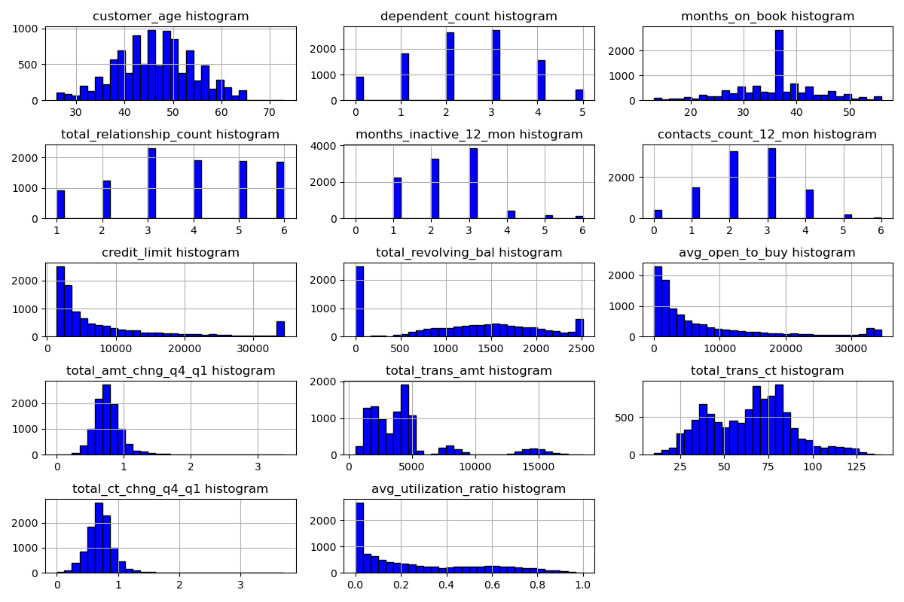
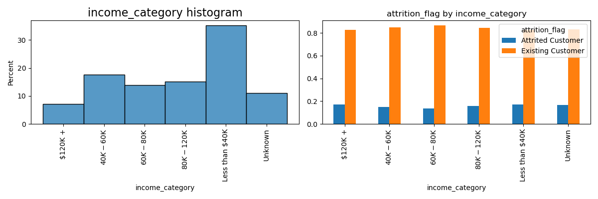
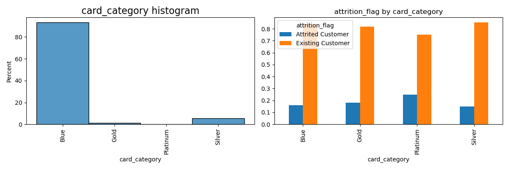
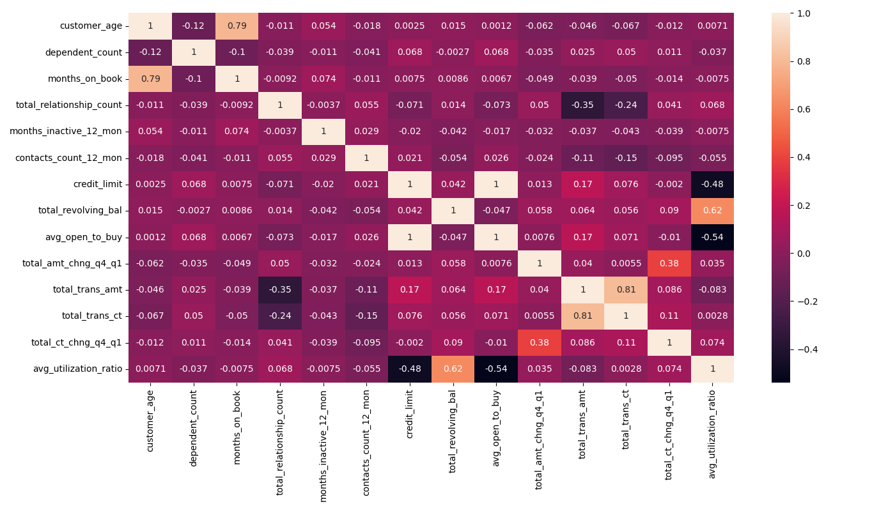
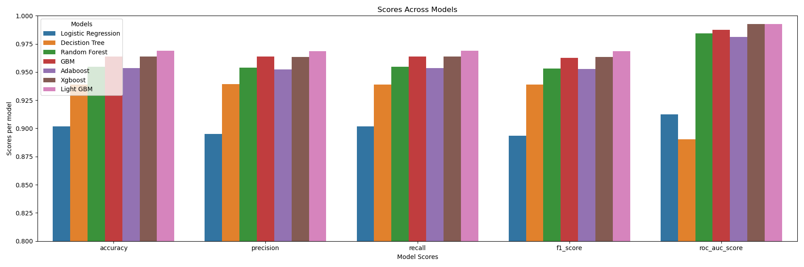
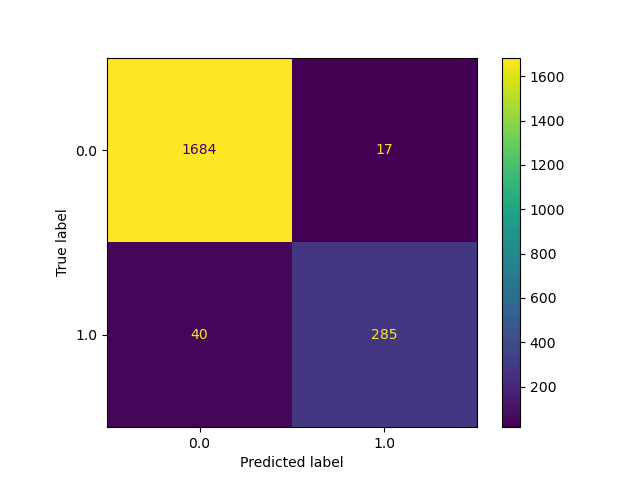
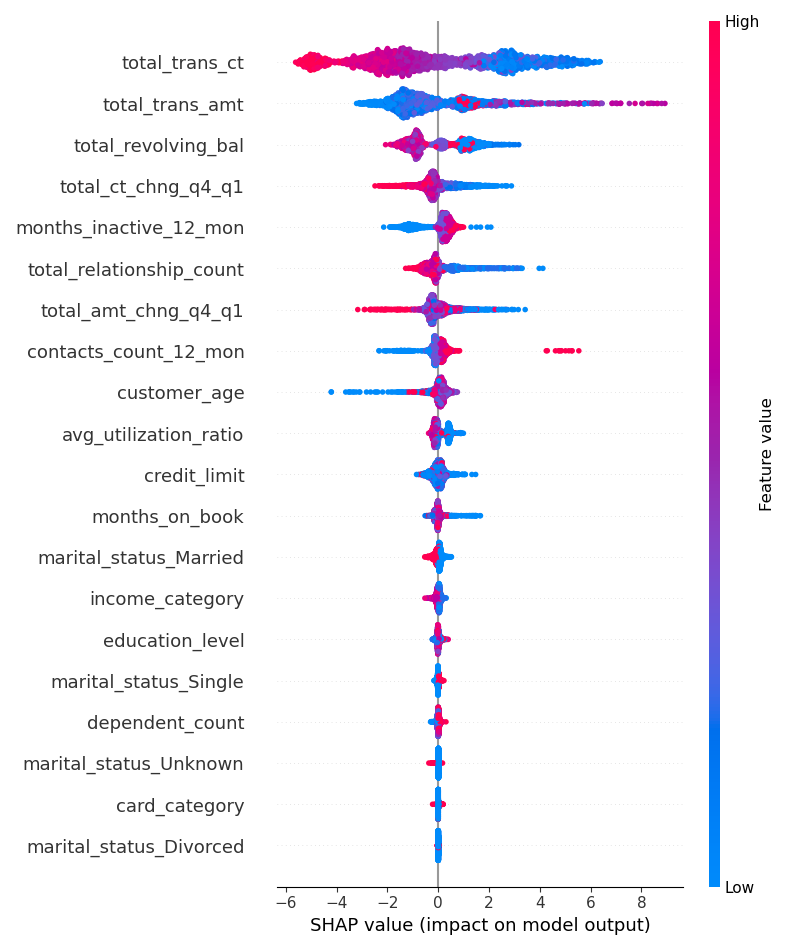

# Capstone Project : Credit Card Customer Churn Prediction Final Report
------

## 1.	Problem Statement:
--------

Banks marketing teams invest a large amount of money for acquiring new credit card customers by launching lots of campaigns and offers, so it's crucial to retain existing customers.

Effective predictive ML models enables the business to pro-actively identify the risk of customer attrition and provide any required offers to prevent customer attrition.

### 1.1 Business Problem Statement

Identify the customers, who are likely to stop using credit card services
- Understand driving factors of churn
- Suggest strategic retention approaches to banks in order to prevent the customer attrition

### 1.2 Objective

The goal of this project is to develop predictive machine learning model to predict credit card customer churn
- Identify the features which impacts the customer churn 
- Build predictive model to accurately classify the likely hood of customer attrition

### 1.3 Expected Results
- Analyze and identify patterns for churn driving factors
- Compare the various model performances and achieve highly accurate predictive model for credit card customer churn
- The resulted model should serve the business to proactively identify and retain customers
- Translate insights into actionable business recommendations

### 1.4 Approach

In order to achieve objective, I will follow below **CRISP-DM** framework steps. 

- For detailed EDA Analysis and Results, please refer [EDA notebook](./notebooks/EDA-creditcard-customer-data.ipynb)
- For feature engineering/model training/model tuning/model evalution results, please refer [modeling notebook](./notebooks/creditcard-customer-churn-prediction-modeling.ipynb)

## 2.	Model Outcomes or Predictions:
---------

The goals of the prediction model are
- To accurately predict whether a given customer will attrition or not
- **False Negatives:** Model predicts the customer will not churn, but actually the customer attrition
    - These increases the missed opportunities for banks and has direct impact on revenue loss prevention
- **False Positives:** Model predicts the customer will churn, but actually the customer will **not** attrition
    - These incurs un necessary operational overhead
 

## 3.	Data Acquisition:
---------

- **Source :** Kaggle's credit card customers dataset [Kaggle data source](https://www.kaggle.com/datasets/sakshigoyal7/credit-card-customers)
- **Description :** This dataset consists of 10,000 customers mentioning their age, salary, marital_status, credit card limit, credit card category, etc. There are nearly 18 features.
- **Rows :** 10K credit card customers data
- **Columns :** 23 features
- **Quality of Data :** We have only 16.07% of customers who have churned. Thus, it's a bit difficult to train our model to predict churning customers
- **Target/Dependent Variable :** Attrition_Flag (if the account is closed then 1 else 0)

### 3.1 Input Dataset Definitions

- **CLIENTNUM :** Client number. Unique identifier for the customer holding the account
- **Attrition_Flag :** Internal event (customer activity) variable - if the account is closed then 1 else 0
- **Customer_Age :** Demographic variable - Customer's Age in Years
- **Gender :** Demographic variable - M=Male, F=Female
- **Dependent_count :** Demographic variable - Number of dependents
- **Education_Level :** Demographic variable - Educational Qualification of the account holder (example: high school, college graduate, etc.)
- **Marital_Status :** Demographic variable - Married, Single, Divorced, Unknown
- **Income_Category :** Demographic variable - Annual Income Category of the account holder (< $40K, $40K - 60K, $60K - $80K, $80K-$120K, > $120K, Unknown)
- **Card_Category :** Product Variable - Type of Card (Blue, Silver, Gold, Platinum)
- **Months_on_book :** Period of relationship with bank
- **Total_Relationship_Count :** Total number of products held by the customer
- **Months_Inactive_12_mon :** Number of months inactive in the last 12 months
- **Contacts_Count_12_mon :** Number of Contacts between the customer and bank in the last 12 months
- **Credit_Limit :** Credit Limit of the Credit Card
- **Total_Revolving_Bal :** The balance that carries over from one month to the next is the revolving balance
- **Avg_Open_To_Buy :** Open to Buy refers to the amount(avg in past 12 months) left on the credit card to use
- **Total_Amt_Chng_Q4_Q1 :** Ratio of the total transaction amount in 4th quarter and the total transaction amount in 1st quarter
- **Total_Trans_Amt :** Total Transaction Amount (Last 12 months)
- **Total_Trans_Ct :** Total Transaction Count (Last 12 months)
- **Total_Ct_Chng_Q4_Q1 :** Ratio of the total transaction count in 4th quarter and the total transaction count in 1st quarter
- **Avg_Utilization_Ratio :** Represents how much of the available credit the customer spent

[Reference](https://www.kaggle.com/datasets/sakshigoyal7/credit-card-customers/data) 

### 3.2 Numerical Feature Types Distributions

### 3.3 Categorical Feature Types Distributions

### 3.4 Feature Correlations

For more data insights, please refer [EDA Analysis](./notebooks/./EDA-creditcard-customer-data.ipynb)

## 4.Data Preprocessing:
--------

Based on [EDA Analysis](./notebooks/./EDA-creditcard-customer-data.ipynb), performed below feature engineering steps
- Removed unnecessary columns
- Stadardized feature names and categorical feature types
- Encoding
  - Robust Scalar Encoding
  - Onehot Encoding (For nominal categorical type features)
  - Ordinal Encoding (For ordinal categorical type features)
- Splitting into training and testing sets

## 5.	Prediction Modeling:
---------

### 5.1 Model Selection Approach 

#### 5.1.1 Considerable Classification Models

| Classification Model | Reason for considering |
|:---|:---:|
| Logistic Regression | Easy to interpret and helps business to understand why customers are churning |
| Decision Tree | Can capture non-linear relationships |
| Random Forest | Reduces the overfitting and improves the accuracy by combining the multiple decision trees|
| Ensemble Methods <ul><li>AdaBoost</li><li>GBM</li><li>XGBoost</li><li>LightGBM</li></ul> | Achieves High Accuracy | 

#### 5.1.2 Model Evaluations Measures

| Evaluation Metric | Definition |
|:---|:---:|
| Accuracy | The overall correctness of the model's predictions |
| Precision | The proposition of correctly predicted churned customers out of **all** customers predicted as churned |
| Recall | The proportion of correctly predicted churned customers out of all **actual** churned customers |
| F1-Score | The harmonic mean of precision and recall, provides a balanced measure for performance | 
| ROC-AUC | A measure of the model's ability to distinguish between customers across different probability thresholds | 

#### 5.1.3 Aligning With Business Requirements

Based on above definitions, our clear goals for models selection criteria are
- **Reduce** False Negatives, which implies selecting the model with high **recall** 
- Select the best performing model, so that bank can take required marketing steps to prevent potential customer churn
  - So focus on model performance/hyper parameter tuning
- Also provide business insights regarding why customers are churning, so that banks can plan for required steps

For more details regarding model tuning and evaluations, please refer [modeling notebook](./notebooks/creditcard-customer-churn-prediction-modeling.ipynb)

## 6. Model Evaluation:
-------

As mentioned in above section, the model selection criteria is to, select the model with high `recall`. Based on below classification models performance results, finalized LGBM model for Credit Card Customer Churn prediction use case

### 6.1 Model Evaluation Results

| Model | accuracy |	precision |	recall	 | f1_score |	roc_auc_score |
|:----: | :-----: | :------------: | :-----: | :-----: | :-------------:|
| Logistic Regression	| 0.901777 |	0.895146 |	0.901777 |	0.893407 |	0.912603 |
| Decistion Tree |	0.938796 |	0.939274 |	0.938796 |	0.939021 |	0.890124 |
| Random Forest	 | 0.954590 |	0.953764 |	0.954590 |	0.952958 |	0.984233 |
| GBM	| 0.963968 |	0.963849 |	0.963968 |	0.962701 |	0.987374 | 
| Adaboost |	0.953603 |	0.952506 |	0.953603 |	0.952618 |	0.981092 |
| Xgboost |	0.963968 |	0.963327 |	0.963968 |	0.963279 |	0.992495 |
| Light GBM |	0.968904 |	0.968437 |	0.968904 |	0.968396 |	0.992699 |

### 6.2 LGBM Validation Confusion Matrix

## 7. Individual Feature Impact on Attrition:
-----------------

### 7.1 Summary
Below are the list of features by their churn prediction impact (By high influence to low influence)
- **total_trans_ct:** Negatively impacted, the lower the value the higher chances to get churned 
- **total_trans_amt:** Negatively impacted, the lower the value the higher chances to get churned 
- **total_revolving_bal:** Negatively impacted, the lower the value the higher chances to get churned 
- **total_amt_chng_q4_q1:** Negatively impacted, the lower the value the higher chances to get churned 
- **months_inactive_12_mon:** Positively impacted, the higher the value the higher the chances to get churned
- **total_relationship_count:** Negatively impacted, the lower the value the higher chances to get churned 
- **total_amt_chng_q4_q1:** Negatively impacted, the lower the value the higher chances to get churned 
- Remaining all features don't have much impact on prediction

For more details regarding model tuning and evaluations, please refer [modeling notebook](./notebooks/creditcard-customer-churn-prediction-modeling.ipynb)

## 8. Conclusion:
----------
- LGBM is the selected model for Credit card churn prediction for business
- Bank should engage with customers with less transaction count
 - Provide more cashback offers, so that customer will get more engaged and it reduces the chances of churn
 - Provide more offers for the customers who is inactive in past 12 months

